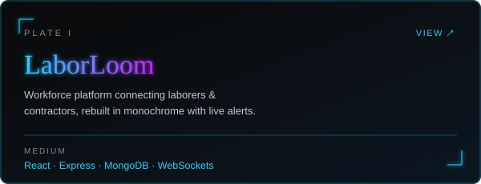
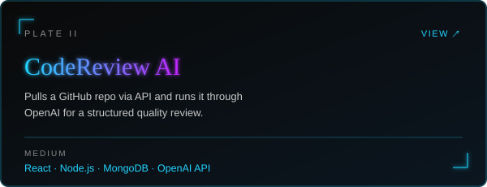
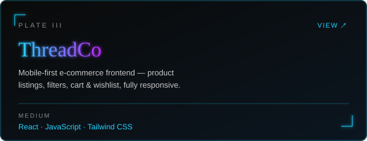
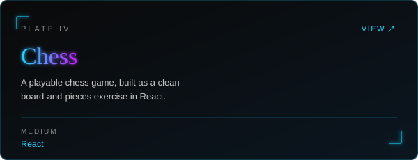
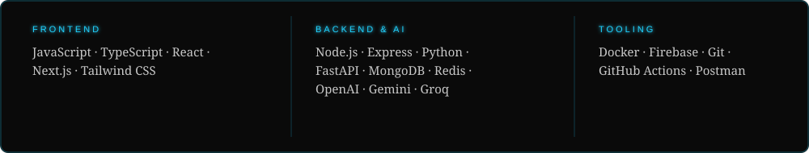
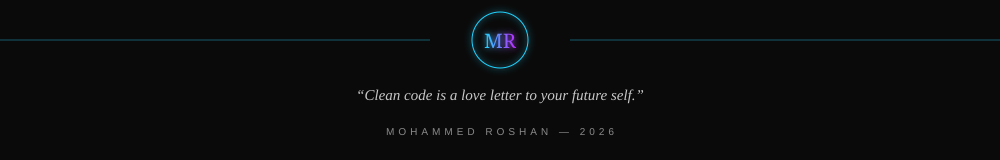

<picture>
  <source media="(prefers-color-scheme: dark)" srcset="./banner-dark.svg">
  <source media="(prefers-color-scheme: light)" srcset="./banner-light.svg">
  
</picture>

 

<a href="https://git.io/typing-svg">
<picture>
  <source media="(prefers-color-scheme: dark)" srcset="https://readme-typing-svg.demolab.com?font=JetBrains+Mono&weight=500&size=14&duration=3000&pause=1200&color=22D3FF&center=true&vCenter=true&width=520&lines=roshan%40fullstack-dev%3A~%24+cat+about.md;open+to+Frontend+%2F+Full+Stack+roles">
  <source media="(prefers-color-scheme: light)" srcset="https://readme-typing-svg.demolab.com?font=JetBrains+Mono&weight=500&size=14&duration=3000&pause=1200&color=7C3AED&center=true&vCenter=true&width=520&lines=roshan%40fullstack-dev%3A~%24+cat+about.md;open+to+Frontend+%2F+Full+Stack+roles">
  
</picture>
</a>

 

I'm a full-stack developer based in Bengaluru, building products end to end — from database schema to deployed UI — with a focus on clean, production-style code rather than demo-ready code. Lately that's meant pairing the MERN stack with Python/FastAPI and LLM APIs to build systems that reason about data, not just display it.

B.E. in Computer Science & Engineering (2025) from Rural Engineering College, Hulkoti, Gadag. 150+ DSA problems solved across LeetCode and GeeksforGeeks, two internships behind me, and currently looking for a Frontend / Full Stack Developer role.

 

<picture>
  <source media="(prefers-color-scheme: dark)" srcset="./divider-dark.svg">
  <source media="(prefers-color-scheme: light)" srcset="./divider-light.svg">
  
</picture>

## The Work

<table width="100%" cellspacing="12">
<tr>
<td width="50%">
<a href="https://github.com/md-rosh02/laborloom">
<picture>
  <source media="(prefers-color-scheme: dark)" srcset="./plate-laborloom-dark.svg">
  <source media="(prefers-color-scheme: light)" srcset="./plate-laborloom-light.svg">
  
</picture>
</a>
</td>
<td width="50%">
<a href="https://github.com/md-rosh02/codereview-ai">
<picture>
  <source media="(prefers-color-scheme: dark)" srcset="./plate-codereview-dark.svg">
  <source media="(prefers-color-scheme: light)" srcset="./plate-codereview-light.svg">
  
</picture>
</a>
</td>
</tr>
<tr>
<td width="50%">
<a href="https://github.com/md-rosh02/threadco">
<picture>
  <source media="(prefers-color-scheme: dark)" srcset="./plate-threadco-dark.svg">
  <source media="(prefers-color-scheme: light)" srcset="./plate-threadco-light.svg">
  
</picture>
</a>
</td>
<td width="50%">
<a href="https://github.com/md-rosh02/chess">
<picture>
  <source media="(prefers-color-scheme: dark)" srcset="./plate-chess-dark.svg">
  <source media="(prefers-color-scheme: light)" srcset="./plate-chess-light.svg">
  
</picture>
</a>
</td>
</tr>
</table>

 

<picture>
  <source media="(prefers-color-scheme: dark)" srcset="./divider-dark.svg">
  <source media="(prefers-color-scheme: light)" srcset="./divider-light.svg">
  
</picture>

## Stack

<picture>
  <source media="(prefers-color-scheme: dark)" srcset="./stack-dark.svg">
  <source media="(prefers-color-scheme: light)" srcset="./stack-light.svg">
  
</picture>

 

<picture>
  <source media="(prefers-color-scheme: dark)" srcset="./divider-dark.svg">
  <source media="(prefers-color-scheme: light)" srcset="./divider-light.svg">
  
</picture>

## Experience

<picture>
  <source media="(prefers-color-scheme: dark)" srcset="./experience-dark.svg">
  <source media="(prefers-color-scheme: light)" srcset="./experience-light.svg">
  
</picture>

 

<picture>
  <source media="(prefers-color-scheme: dark)" srcset="./divider-dark.svg">
  <source media="(prefers-color-scheme: light)" srcset="./divider-light.svg">
  
</picture>

## In Numbers

<picture>
  <source media="(prefers-color-scheme: dark)" srcset="https://github-readme-stats.vercel.app/api?username=md-rosh02&show_icons=true&hide_border=false&border_color=22D3FF&bg_color=0A0A0A&title_color=22D3FF&icon_color=22D3FF&text_color=C7C7C7&ring_color=22D3FF">
  <source media="(prefers-color-scheme: light)" srcset="https://github-readme-stats.vercel.app/api?username=md-rosh02&show_icons=true&hide_border=false&border_color=7C3AED&bg_color=FAFAF8&title_color=7C3AED&icon_color=7C3AED&text_color=2E2E2E&ring_color=7C3AED">
  
</picture>
<picture>
  <source media="(prefers-color-scheme: dark)" srcset="https://github-readme-stats.vercel.app/api/top-langs/?username=md-rosh02&layout=compact&hide_border=false&border_color=22D3FF&bg_color=0A0A0A&title_color=22D3FF&text_color=C7C7C7">
  <source media="(prefers-color-scheme: light)" srcset="https://github-readme-stats.vercel.app/api/top-langs/?username=md-rosh02&layout=compact&hide_border=false&border_color=7C3AED&bg_color=FAFAF8&title_color=7C3AED&text_color=2E2E2E">
  
</picture>

<picture>
  <source media="(prefers-color-scheme: dark)" srcset="https://streak-stats.demolab.com?user=md-rosh02&theme=dark&background=0A0A0A&border=22D3FF&ring=22D3FF&fire=22D3FF&currStreakLabel=22D3FF&sideNums=C7C7C7&sideLabels=C7C7C7&dates=666666">
  <source media="(prefers-color-scheme: light)" srcset="https://streak-stats.demolab.com?user=md-rosh02&theme=default&background=FAFAF8&border=7C3AED&ring=7C3AED&fire=7C3AED&currStreakLabel=7C3AED&sideNums=2E2E2E&sideLabels=2E2E2E&dates=8A8A8A">
  
</picture>

 

<picture>
  <source media="(prefers-color-scheme: dark)" srcset="./footer-dark.svg">
  <source media="(prefers-color-scheme: light)" srcset="./footer-light.svg">
  
</picture>

