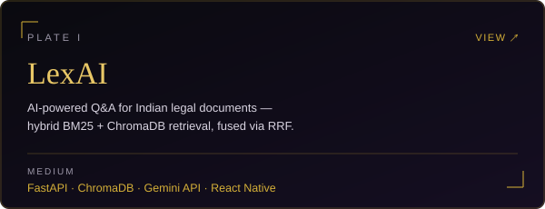
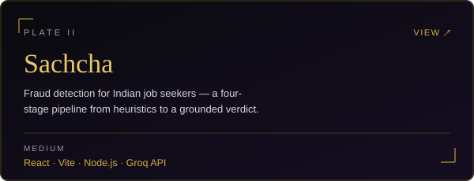
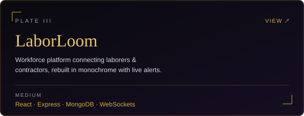
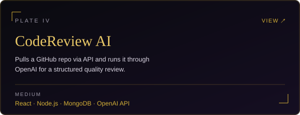
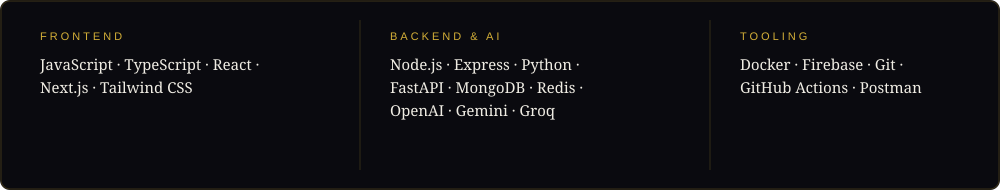
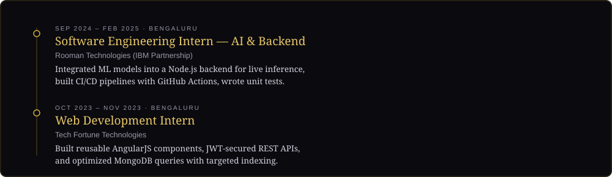
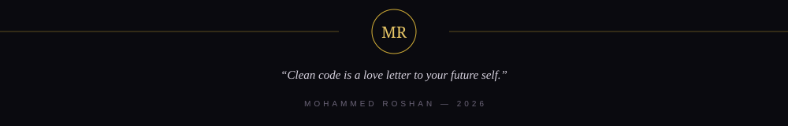

 

 

I'm a full-stack developer based in Bengaluru, building products end to end — from database schema to deployed UI — with a focus on clean, production-style code rather than demo-ready code. Lately that's meant pairing the MERN stack with Python/FastAPI and LLM APIs to build systems that reason about data, not just display it.

B.E. in Computer Science & Engineering (2025) from Rural Engineering College, Hulkoti, Gadag. 150+ DSA problems solved across LeetCode and GeeksforGeeks, two internships behind me, and currently looking for a Frontend / Full Stack Developer role.

 

## The Work

<table width="100%" cellspacing="12">
<tr>
<td width="50%">

</td>
<td width="50%">

</td>
</tr>
<tr>
<td width="50%">

</td>
<td width="50%">

</td>
</tr>
</table>

also on the shelf — <b>ThreadCo</b>, a mobile-first e-commerce frontend in React + Tailwind &middot; <a href="https://github.com/md-rosh02/threadco">repo &#8599;</a>

 

## Stack

 

## Experience

 

## In Numbers

 

